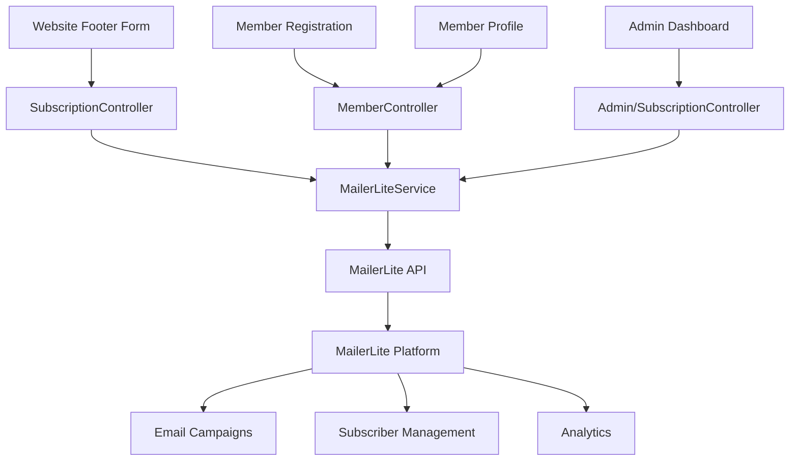

# Newsletter Subscription System - Design Document

## Overview

The newsletter subscription system integrates with MailerLite's API to manage email subscriptions for church members and visitors. The system provides a seamless subscription experience through the website footer and member registration, while leveraging MailerLite's robust email delivery and campaign management features.

The architecture follows a service-oriented approach where a dedicated MailerLiteService handles all API interactions, ensuring clean separation of concerns and easy testability.

## Architecture

### High-Level Architecture



### Component Interaction Flow

1. **Subscription Flow**: User submits email → Controller validates → Service calls MailerLite API → Response handled
2. **Member Registration Flow**: Member registers → Controller checks newsletter preference → Service syncs to MailerLite
3. **Profile Update Flow**: Member toggles subscription → Controller updates → Service syncs to MailerLite
4. **Admin Management Flow**: Admin views/manages subscribers → Service fetches from MailerLite API → Display results

## Components and Interfaces

### 1. MailerLiteService

The core service that handles all MailerLite API interactions.

```php
class MailerLiteService
{
    private string $apiKey;
    private string $groupId;
    private Client $httpClient;
    
    public function __construct()
    public function subscribe(string $email, array $fields = []): bool
    public function unsubscribe(string $email): bool
    public function getSubscriber(string $email): ?array
    public function getAllSubscribers(int $limit = 100, int $offset = 0): array
    public function getSubscriberCount(): int
    public function updateSubscriber(string $email, array $fields): bool
    private function makeRequest(string $method, string $endpoint, array $data = []): array
}
```

### 2. SubscriptionController

Handles public-facing subscription requests from the footer form.

```php
class SubscriptionController extends Controller
{
    public function __construct(private MailerLiteService $mailerLite)
    public function subscribe(Request $request): JsonResponse
    public function unsubscribe(Request $request): RedirectResponse
    public function confirmUnsubscribe(string $email): View
}
```

### 3. Admin/SubscriptionController

Manages admin operations for viewing and managing subscribers.

```php
class Admin\SubscriptionController extends Controller
{
    public function __construct(private MailerLiteService $mailerLite)
    public function index(Request $request): View
    public function store(Request $request): RedirectResponse
    public function destroy(string $email): RedirectResponse
    public function export(): Response
}
```

### 4. MemberController Updates

Extends existing MemberController to handle newsletter subscription during registration and profile updates.

```php
// Additional methods in existing MemberController
private function syncNewsletterSubscription(Member $member, bool $subscribe): void
```

## Data Models

### Member Model Updates

Add newsletter subscription tracking to the existing Member model:

```php
class Member extends Model
{
    protected $fillable = [
        // ... existing fields
        'newsletter_subscribed',
        'newsletter_subscribed_at',
    ];
    
    protected $casts = [
        'newsletter_subscribed' => 'boolean',
        'newsletter_subscribed_at' => 'datetime',
    ];
    
    public function subscribeToNewsletter(): void
    public function unsubscribeFromNewsletter(): void
    public function isSubscribedToNewsletter(): bool
}
```

### Database Schema

```sql
-- Migration: add newsletter fields to members table
ALTER TABLE members ADD COLUMN newsletter_subscribed BOOLEAN DEFAULT FALSE;
ALTER TABLE members ADD COLUMN newsletter_subscribed_at TIMESTAMP NULL;

-- No separate subscriptions table needed since MailerLite is the source of truth
```

## Correctness Properties

*A property is a characteristic or behavior that should hold true across all valid executions of a system-essentially, a formal statement about what the system should do. Properties serve as the bridge between human-readable specifications and machine-verifiable correctness guarantees.*


### Property Reflection

After reviewing all testable properties from the prework, several can be consolidated:

- Properties 3.2, 5.2, and 8.2 all relate to syncing subscription changes to MailerLite - these can be combined into one comprehensive "sync consistency" property
- Properties 7.1, 7.2, and 7.3 all relate to admin management operations - these can be combined into one "admin operations" property
- Properties 1.3 and 2.4 are unique and provide distinct validation value
- Properties 3.2 and 5.4 both ensure database consistency with subscription status - these can be combined

### Testable Properties

Property 1: Email validation correctness
*For any* string input, the email validation should accept valid email formats and reject invalid formats according to RFC 5322 standards
**Validates: Requirements 1.1**

Property 2: Duplicate subscription idempotency
*For any* email address, attempting to subscribe twice should be handled gracefully without errors and inform the user appropriately
**Validates: Requirements 1.3**

Property 3: Member metadata sync
*For any* member with a name and email, when subscribed to MailerLite, the API request should include their name and member status as custom fields
**Validates: Requirements 2.4**

Property 4: Subscription state consistency
*For any* member, when their subscription preference changes (subscribe or unsubscribe), both the member database record and MailerLite should reflect the same subscription status
**Validates: Requirements 3.2, 5.2, 5.4, 8.2**

Property 5: Search result filtering
*For any* search query on the admin subscribers page, all returned results should contain the search term in the email address
**Validates: Requirements 6.3**

Property 6: Subscriber display completeness
*For any* subscriber displayed in the admin interface, the display should include email, subscription date, status, and subscriber type
**Validates: Requirements 6.2**

Property 7: Admin operations sync
*For any* admin operation (add, remove, or reactivate subscriber), the operation should result in a corresponding API call to MailerLite that updates the subscriber status
**Validates: Requirements 7.1, 7.2, 7.3**

Property 8: API authentication
*For any* API request to MailerLite, the request should include the configured API key in the authorization header
**Validates: Requirements 9.3**

## Error Handling

### API Error Handling

The system must gracefully handle various MailerLite API errors:

1. **Network Errors**: Timeout or connection failures
   - Log the error with full context
   - Display user-friendly message: "Unable to connect to email service. Please try again later."
   - Do not update local database state

2. **Authentication Errors** (401 Unauthorized):
   - Log the error with API key prefix (first 4 characters only)
   - Display: "Email service configuration error. Please contact support."
   - Alert administrators via notification system

3. **Rate Limiting** (429 Too Many Requests):
   - Extract retry-after header
   - Queue the request for retry after specified time
   - Display: "Service is busy. Your request will be processed shortly."

4. **Validation Errors** (400 Bad Request):
   - Parse error response for specific field errors
   - Display field-specific error messages to user
   - Log the validation failure

5. **Server Errors** (500 Internal Server Error):
   - Log the error with request details
   - Display: "Email service is temporarily unavailable. Please try again later."
   - Implement exponential backoff for retries

### Data Consistency

To maintain consistency between the local database and MailerLite:

1. **Optimistic Updates**: Update local database only after successful API response
2. **Rollback Strategy**: If API call fails after database update, revert the database change
3. **Sync Verification**: Periodic background job to verify local subscription status matches MailerLite
4. **Conflict Resolution**: If discrepancies found, MailerLite is the source of truth

### Validation

Input validation at multiple layers:

1. **Client-side**: JavaScript validation for immediate feedback
2. **Server-side**: Laravel validation rules before API calls
3. **Service-level**: Additional validation in MailerLiteService before making requests

## Testing Strategy

### Unit Testing

Unit tests will verify specific behaviors and integration points:

1. **MailerLiteService Tests**:
   - Test API request construction with correct headers and payload
   - Test response parsing for success and error cases
   - Test error handling for various HTTP status codes
   - Mock HTTP client to avoid actual API calls

2. **Controller Tests**:
   - Test request validation rules
   - Test response formatting (JSON for AJAX, redirects for forms)
   - Test error message display
   - Mock MailerLiteService to isolate controller logic

3. **Member Model Tests**:
   - Test newsletter subscription methods update correct fields
   - Test timestamp updates on subscription changes

### Property-Based Testing

Property-based tests will verify universal properties across many inputs using a PHP property testing library (e.g., Eris or Pest with Faker):

1. **Email Validation Property Test**:
   - Generate random valid and invalid email strings
   - Verify validation correctly identifies valid vs invalid
   - Minimum 100 iterations

2. **Idempotency Property Test**:
   - Generate random email addresses
   - Subscribe twice and verify no errors occur
   - Verify second subscription returns "already subscribed" response
   - Minimum 100 iterations

3. **Metadata Sync Property Test**:
   - Generate random member data (names, emails)
   - Verify API payload includes all custom fields
   - Minimum 100 iterations

4. **State Consistency Property Test**:
   - Generate random subscription state changes
   - Verify database and MailerLite mock stay in sync
   - Minimum 100 iterations

5. **Search Filtering Property Test**:
   - Generate random subscriber lists and search queries
   - Verify all results contain the search term
   - Minimum 100 iterations

6. **Display Completeness Property Test**:
   - Generate random subscriber data
   - Verify rendered output contains all required fields
   - Minimum 100 iterations

7. **Admin Operations Property Test**:
   - Generate random admin operations (add/remove/reactivate)
   - Verify each operation triggers correct API call
   - Minimum 100 iterations

8. **Authentication Property Test**:
   - Generate random API requests
   - Verify all include authentication header
   - Minimum 100 iterations

Each property-based test will be tagged with a comment referencing the design document property:
```php
// Feature: newsletter-subscription, Property 1: Email validation correctness
```

### Integration Testing

Integration tests will verify the complete flow with a test MailerLite account:

1. Test complete subscription flow from form submission to MailerLite
2. Test member registration with newsletter subscription
3. Test profile update subscription toggle
4. Test admin subscriber management operations

### Testing Configuration

- Use Laravel's testing environment with separate test database
- Mock MailerLite API calls in unit tests using HTTP fake
- Use test MailerLite API key for integration tests
- Configure separate MailerLite group for testing

## Implementation Notes

### MailerLite API Integration

The system will use MailerLite's REST API v2:

- **Base URL**: `https://api.mailerlite.com/api/v2/`
- **Authentication**: API key in `X-MailerLite-ApiKey` header
- **Key Endpoints**:
  - `POST /groups/{groupId}/subscribers` - Add subscriber
  - `DELETE /subscribers/{email}` - Remove subscriber
  - `GET /groups/{groupId}/subscribers` - List subscribers
  - `GET /subscribers/{email}` - Get subscriber details
  - `PUT /subscribers/{email}` - Update subscriber

### Environment Configuration

Required environment variables:

```env
MAILERLITE_API_KEY=your_api_key_here
MAILERLITE_GROUP_ID=your_group_id_here
```

### Rate Limiting

MailerLite API limits:
- 120 requests per minute for standard plans
- Implement request throttling in service layer
- Use Laravel's rate limiting for public endpoints

### Security Considerations

1. **API Key Protection**: Store in environment variables, never commit to version control
2. **Input Sanitization**: Validate and sanitize all email inputs
3. **CSRF Protection**: Use Laravel's CSRF tokens for all forms
4. **Rate Limiting**: Limit subscription attempts per IP address
5. **Logging**: Log all API interactions but redact sensitive data

### Performance Optimization

1. **Caching**: Cache subscriber count for admin dashboard (5-minute TTL)
2. **Async Processing**: Queue API calls for bulk operations
3. **Pagination**: Paginate subscriber lists in admin interface
4. **Lazy Loading**: Load subscriber details on-demand

### Monitoring and Logging

Log the following events:

1. All API requests and responses (with sensitive data redacted)
2. Subscription/unsubscription events
3. API errors and failures
4. Rate limit encounters
5. Configuration errors

Use Laravel's logging system with appropriate log levels:
- `info`: Successful operations
- `warning`: Rate limits, retries
- `error`: API failures, configuration errors
- `critical`: Authentication failures

## Future Enhancements

Potential future improvements:

1. **Webhook Integration**: Receive real-time updates from MailerLite for unsubscribes
2. **Segmentation**: Create multiple subscriber groups for different content types
3. **Preference Center**: Allow subscribers to choose email frequency and topics
4. **Analytics Dashboard**: Display campaign statistics within admin interface
5. **A/B Testing**: Integrate MailerLite's A/B testing features
6. **Automation Triggers**: Trigger MailerLite automations based on member actions
